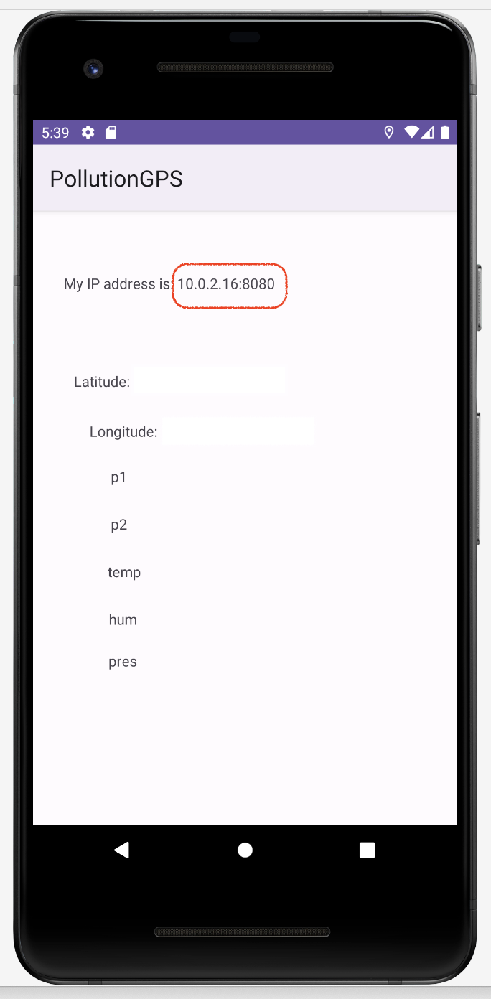

# PollutionGPS Android App #

Collects data from the NodeMCU ESP8266 CPU/WLAN sensor with SDS011 (fine dust sensor) and BME280 (temperature, humidity, and pressure) from [sensor.community](https://sensor.community/es/sensors/airrohr/). It stores the sensor data along with the Android GPS latitude and longitude in a CSV file within a folder inside the "Downloads" folder on Android.

Beware that the brisk movements of the sensor can cause false readings. Try to move the sensor gently. The app should always be on, so I added a wakeLock, which could drain the battery quickly. As the sensors need power, it is advisable to use an external battery to connect both the sensor and the cellphone.

You need to share the cellphone data connection with the sensor and configure the sensor to send the data to the HTTP service on the Android on port 8080. The app shows the IP address of the Android.

More instructions soon...
